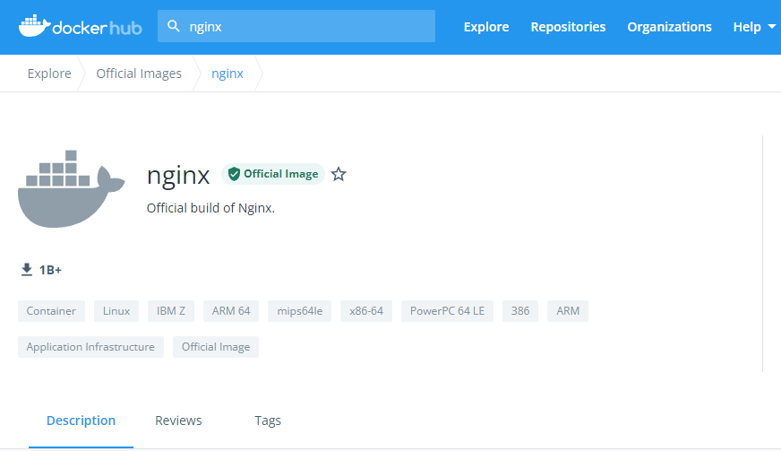
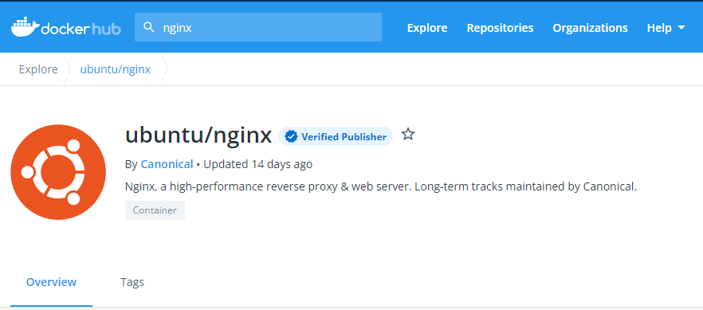
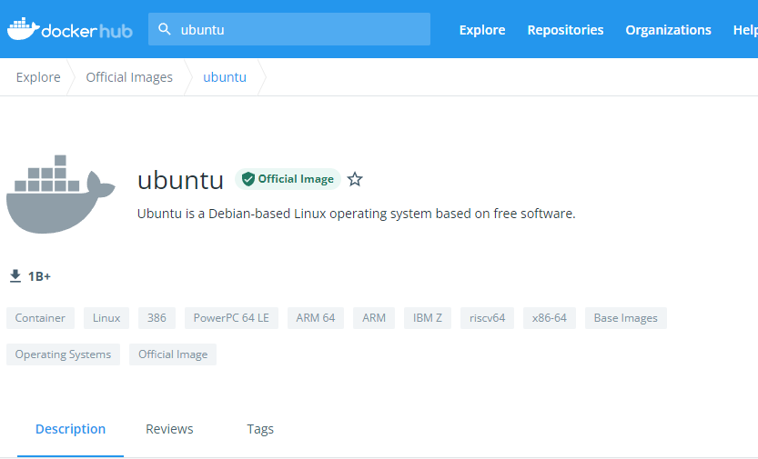
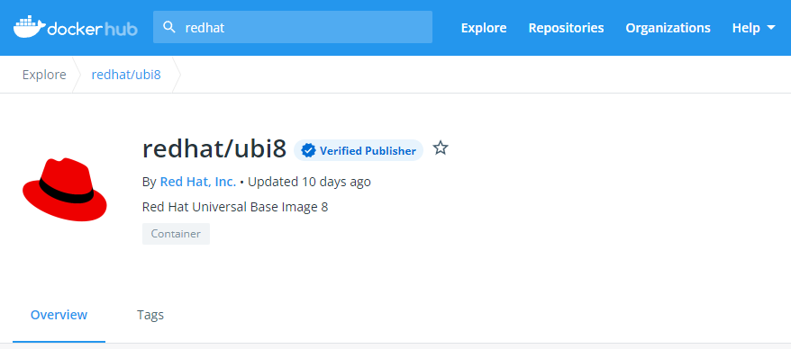

== とりあえずコンテナを動かす

=== コンテナを実行する環境を作る

コンテナの実行環境として、 `Docker Desktop` を使用します。 `Windows` 版、 `Mac` 版がありますが、以下からダウンロードします。

個人用途であれば無償で使用できます。

https://www.docker.com/products/docker-desktop

何が一番楽でお金がかからないだろうか。と考えた結果、 `Mac` でも `Windows` でも共通に使えて、作業も楽なので、 `Docker Desktop` を選択してみました。
`Linux` の仮想マシンを立てて、そこで `docker` を動かすなど選択肢はたくさんあると思いますのでお好きなもので構いません。

このドキュメントを書いた、筆者の環境は 「Windows 10」 + 「Docker Desktop for Windows」 + 「WSL2」 です。

=== コンテナを動かしてみる

例として、 `nginx` のコンテナを動かしてみます。このコンテナは https://hub.docker.com/[Docker Hub^] 上に既にあるものを使用します。

コンテナは覚えなければいけない概念などがいろいろありますが、細かい話は後に譲るとして、このセクションでは、まずは単純に動かしてみて、「雰囲気」を掴んでみる事にしてみます。

`Docker Hub` から `nginx` のイメージをダウンロードして、コンテナを実行するには以下のコマンドを実行します。

[source, bash]
----
$ docker run nginx
----

これだけです。ただこれだと

```
$ docker run nginx
<省略>
2021/11/18 07:46:52 [notice] 1#1: nginx/1.21.3
2021/11/18 07:46:52 [notice] 1#1: built by gcc 8.3.0 (Debian 8.3.0-6)
2021/11/18 07:46:52 [notice] 1#1: OS: Linux 4.19.84-microsoft-standard
2021/11/18 07:46:52 [notice] 1#1: getrlimit(RLIMIT_NOFILE): 1048576:1048576
2021/11/18 07:46:52 [notice] 1#1: start worker processes
2021/11/18 07:46:52 [notice] 1#1: start worker process 31
2021/11/18 07:46:52 [notice] 1#1: start worker process 32
2021/11/18 07:46:52 [notice] 1#1: start worker process 33
2021/11/18 07:46:52 [notice] 1#1: start worker process 34
2021/11/18 07:46:52 [notice] 1#1: start worker process 35
2021/11/18 07:46:52 [notice] 1#1: start worker process 36
2021/11/18 07:46:52 [notice] 1#1: start worker process 37
2021/11/18 07:46:52 [notice] 1#1: start worker process 38
2021/11/18 07:46:52 [notice] 1#1: start worker process 39
2021/11/18 07:46:52 [notice] 1#1: start worker process 40
2021/11/18 07:46:52 [notice] 1#1: start worker process 41
2021/11/18 07:46:52 [notice] 1#1: start worker process 42
```

のようにプロンプトが戻ってこないので **「Ctrl + C」で処理を停止してください。**

次に `-d` オプションを付けた、以下を実行してみます。

```
$ docker run -d nginx
b0d570e09018fac53c58db702ca09c7689b200bd58bf3fad79748d240a8e3129
$
```

今度はプロンプトが戻ってきたと思います。ここで使われている `-d` 「デタッチ」を意味します。先ほど、 `-d` を付けなかった時にプロンプトが返ってこなかった事と較べると、なんとなく「デタッチ」の感覚がつかめると思います。

==== 稼働中のコンテナの確認

起動中のコンテナを確認するには、 `docker ps` を実行します。

```
$ docker ps    # 起動中のコンテナの確認
CONTAINER ID   IMAGE     COMMAND                  CREATED         STATUS         PORTS     NAMES
b0d570e09018   nginx     "/docker-entrypoint.…"   5 seconds ago   Up 3 seconds   80/tcp    eager_benz
$
```

`ps` からイメージできるように、稼働中のコンテナをリストしてくれます。
一つのコンテナが起動しているのがわかると思います。コンテナが仮想マシンとは違い「隔離されたプロセス」である事をなんとなく示唆してくれるコマンド名になっています。

一番後ろの `NAMES` のコラムを見ると `eager_benz` と名前が付いてます。
この名前は自分が指定した名前も付ける事ができますが、**ユーザーが指定しなければ勝手につけられます。**
ランダムな名前は、 **「形容詞」+「著名人の名前」** の形で生成されています。namesgenerator というパッケージで生成されておりソースは https://github.com/moby/moby/blob/master/pkg/namesgenerator/names-generator.go[こちら^] です。

`CONTAINER ID (b0d570e09018)` と `NAME (eager_benz)` は、自動で付けられるユニークな値で、コンテナの停止や開始時に識別子として使用する事ができます。

==== コンテナ名でコンテナを停止

コンテナを停止するには、 `docker stop <コンテナ名 | CONTAINER ID>` を使用します。
まずはコンテナ名を指定して停止させてみます。

```
$ docker stop eager_benz   # 起動したコンテナの停止
eager_benz
$
```

`docker ps` で、起動しているコンテナが居ない事の確認

```
$ docker ps  
CONTAINER ID   IMAGE     COMMAND   CREATED   STATUS    PORTS     NAMES
$
```

==== コンテナIDでコンテナを停止

さっきは `eager_benz` というコンテナ名を指定してを停止させましたが、 `CONTAINER ID` を使って以下のように停止させる事もできます。

```
$ docker stop b0d570e09018     # 最後の IDは docker ps で表示されていた CONTAINER ID
```

停止したコンテナは完全に消えたわけではなく、停止した状態で残っています。以下のコマンドで停止中のコンテナを表示させる事ができます。

```
$ docker ps -a
CONTAINER ID   IMAGE     COMMAND                   CREATED            STATUS                        PORTS     NAMES
b0d570e09018   nginx     "/docker-entrypoint.…"   20 minutes ago   Exited (0) 5 minutes ago                   eager_benz
$ 
```     

`CONTAINER ID` や、 `NAMES` の欄の値が起動していた時と同じ値である事を確認して下さい。

==== 停止したコンテナの削除

完全にコンテナを消去するには、`docker rm  <コンテナ名 | CONTAINER ID>` を使用します。

```
$ docker rm eager_benz
eager_benz
```

コンテナが消えたか確認します。

```
$ docker ps -a
CONTAINER ID     IMAGE       COMMAND       CREATED     STATUS         PORTS      NAMES
$
```

==== イメージのリスト

コンテナは消えましたが、コンテナの元になったイメージ `nginx` は、そのまま残っています。
イメージを確認するには `docker images` で確認します。

```
$ docker images
REPOSITORY                          TAG       IMAGE ID       CREATED         SIZE
nginx                               latest    ea335eea17ab   1 weeks ago     141MB
$
```

コンテナの `イメージ` と、それから作成される `コンテナ` の関係がなんとなく理解できたかなと思います。

`イメージ` と `コンテナ` は、大半のコンテキストで同じ意味の言葉として使用でき、合体させて `コンテナ・イメージ` 等と曖昧に使うケースもありますが、 `docker` コマンドの世界では、 `dockerイメージ` と `dockerコンテナ` は、明確に違うものを示します。

関係を図示すると以下のようになります。

image::images/1-2-image-and-container.png[align="left"]

docker `イメージ` から作成されるのが docker `コンテナ` になります。


==== イメージの削除

イメージを削除するには、`docker rmi <REPOSITORY名:TAG>` で削除します。

```
$ docker rmi nginx:latest
Untagged: nginx:latest
Untagged: nginx@sha256:097c3a0913d7e3a5b01b6c685a60c03632fc7a2b50bc8e35bcaa3691d788226e
Deleted: sha256:ea335eea17ab984571cd4a3bcf90a0413773b559c75ef4cda07d0ce952b00291
Deleted: sha256:cc284e9b1cbed75793782165a07a0c2139d8ec0116d1d562c0e2e504ed586238
Deleted: sha256:6207e091bef7f1c94a109cb455ba163d53d7c2c641de65e71d3a0f33c0ebd8ae
Deleted: sha256:97a18ff8c6973f64d763f004cad932319a1428e0502c0ec3e671e78b2f14256b
Deleted: sha256:319130834f01416a2e8f9a4f2b2fa082c702ac21f16e0e2a206e23d53a0a3bae
Deleted: sha256:1bc375f72973dc110c9629a694bc7476bf878d244287c0214e6436afd6a9d1b0
$
```

dockerの世界では、 `TAG` も名前の一部で、イメージを削除する時は `TAG` も指定する必要がある事に注意して下さい。

=== レポジトリとタグとイメージ名

ここでは「レポジトリ」名、「タグ」名、「イメージ」名について、少し考えて見ます。

`docker images` の出力をよく見てみます。

```
$ docker images
REPOSITORY                       TAG       IMAGE ID       CREATED         SIZE
nginx                            latest    f652ca386ed1   3 weeks ago     141MB
nginx                            1.20      aedf7f31bdab   5 weeks ago     141MB
redhat/ubi8                      latest    cc0656847854   7 weeks ago     216MB
ubuntu                           latest    ba6acccedd29   2 months ago    72.8MB
```

ヘッダー部分の所に `REPOSITORY` と書いています。

少し前のステップで、イメージの削除は `docker rmi <REPOSITORY名:TAG>` で行う。とさらっと `REPOSITORY名` という言葉をつかっています。直感的には、この `REPOSITORY名` の所は `イメージ名` で良いような気もします。この `REPOSITORY` とは何でしょうか。

イメージは `latest` や、 `1.0` 等のバージョンを表す `タグ` を付ける事で、同じグループのイメージである事を示す事ができます。 `タグ` より前の部分の名前が同じであれば、同じグループとみなされます。 `docker` では、このグループの概念を `レポジトリ` と読んでいます。

image::images/1-3-repository.png[left]

ですので、 `docker images` の出力では、 `イメージ名` ではなく `レポジトリ` という表現になっています。

`レポジトリ名` だけでは、イメージを任意に区別できないので、 `レポジトリ` 名 + `タグ` 名の形で `docker` コマンドの引数に指定するのが殆どです。

====  ユニークなイメージ

また、忘れてはいけないのは `IMAGE ID` でも `イメージ` を区別できます。

`IMAGE ID` は、その `イメージ` のデータとしての一意性を示します。そのため、 `IMAGE ID` が同じでも違う `レポジトリ` 名 + `タグ` 名を持つイメージも存在しえます。

以下の例は、ある `イメージ` を別の `イメージ` にコピーし作成した時の出力例です。 `copy:1.0` と `nginx-ubi8:1.0` は、データとしては同じものなので、同じ `IMAGE ID` を持っています。

```
$ docker images
REPOSITORY                    TAG       IMAGE ID       CREATED         SIZE  
copy                          1.0       6c364457d832   3 days ago      303MB 
nginx-ubi8                    1.0       6c364457d832   3 days ago      303MB 
...
```

`docker` の世界では、一意に決まるユニークな `イメージ` を想像した時に、 `レポジトリ` 名 + `タグ` 名 としての一意なのか、 `IMAGE ID` として一意なのか2通りの捉え方がある事に注意しましょう。


====  Docker のイメージ名とは？

Docker の公式のドキュメントを `イメージ名(image name)` で検索すると、 `image name` という言葉の使われている場所は非常に少ないのです。が、例えば、 https://docs.docker.com/engine/reference/commandline/inspect/#get-an-instances-image-name[Get an instance’s image name^] (インスタンスの「イメージ名」を取得する) の項目で紹介されている `docker inspect` コマンドで得られる `imagne name` とされるものは、 `tag` を含んだ `<レポジトリ>:<タグ>` の値です。(タグがlatestの場合は省略される)。

```docker
$ docker inspect --format='{{.Config.Image}}' c3775755f851
nginx:1.20
$ 
```

ただ、一般的には `タグ` を抜いた `レポジトリ` 名の事を `イメージ` 名と呼んで説明しているケースもあり、 `イメージ(名)` の定義はきちんと定まっておらず曖昧に使われているのが現状で、インターネットを検索すると呼び方に関する議論も見つける事ができます。英語圏でもこの議論が見つかるので、翻訳の問題ではないようです。言葉の使われ方が安定していなのは、初学者にはつらい所です。

以下は `docker tag` コマンドのヘルプですが、 `レポジトリ名` と解釈される所は `SOURCE_IMAGE/TARGET_IMAGE` と記載されていて `[:TAG]` を付ける事ができるとされています。つまり、ここでは `SOURCE_IMAGE/TARGET_IMAGE` (つまりイメージ名) が `REPOSITORY` 名と同じ意味で使われています。

```
$ docker tag --help
Usage:  docker tag SOURCE_IMAGE[:TAG] TARGET_IMAGE[:TAG]
```

さらに、実際のコマンド実行時にどのように使われているかに目を向けると、 `docker run nginx` と書いた時の `nginx` は、 `<レポジトリ名>:<タグ名>` です。これは、表記上、省略されているだけで、実際には `nginx` は  `nginx:latest` と解釈されます。ですので、タグが無い=レポジトリ名という区別も単純にはできません。

`docker` では、省略した記述が許されているため `nginx` と書いた時にそれはコンテキストによって `レポジトリ` であったり、 `イメージ名` でもありえます。さらに前述した `docker tag` コマンドのヘルプのように、タグを抜いた部分を「 `イメージ` (名)」と呼んでいるケースもあります。

はじめのうちは混乱する部分なので、頭を柔軟に保つ必要があります。

このガイドでは基本的に `<レポジトリ名>:<タグ>` の組み合わせを `イメージ` 名と呼ぶ事にします。

====  レポジトリ名の表記

`レポジトリ名` と `イメージ(名)` についての基本を学んだので、初学者が混乱する `レポジトリ` 名の表記の種類について、実例をみながら理解を深めてみます。

以下は `NGINX` 社が提供している `nginx` イメージの `レポジトリ` です。この `レポジトリ` 名は `nginx` です。
この `ポジトリ` の最新イメージを使用したい時は、`nginx:latest` のように指定します。




以下は、 `ubuntu` が提供している `nginx` イメージの `レポジトリ` です。このレポジトリ名は `ubuntu/nginx` です。
このレポジトリの最新イメージを使用したい時は、`ubuntu/nginx:latest` のように指定します。




以下は、 `ubuntu` が提供しているコンテナ用の `ubuntu` OSの `レポジトリ` です。この `レポジトリ` 名は `ubuntu/nginx` です。
この `レポジトリ` の最新イメージを使用したい時は、`ubuntu:latest` のように指定します。




以下は、 `Red Hat` 社が提供しているコンテナ用の RHEL OS の `レポジトリ`です。 `Red Hat` 社は、コンテナ用の OSイメージは RHEL 8 のようには呼ばず `UBI (Universal Base Image) 8` のように呼びます。これは `ubi8` のイメージです。レポジトリ名は `redhat/ubi8` です。
この `レポジトリ` の最新イメージを使用したい時は、 `redhat/ubi8:latest` のように指定します。



はじめのうちは、 `/` が入って居ると「 `/` の前が `レポジトリ名` で…」のように考えてしまいますが、 `レポジトリ` 名 には `/` が入って居る場合もありますし、そうで無い場合もあります。

アプリケーションの提供ベンダーの名前が必ず `/` で区切られて `レポジトリ` 名に含まれている。という事もありません。

後述しますが、 `Docker Hub` のユーザー名を `/` を使って `レポジトリ` 名として付加するケースもあるので、 `/` の前が必ずベンダー名という事もありません。

「`レポジトリ` 名には `/` が入って居る場合もあるし、そうでない場合もある。区切りの意味もその時々」くらいに考えておいて、 `/` に必要以上に惑わされないようにしましょう。

=== このセクションで使用したコマンド

初めのうちはコマンドを覚えられないと思うので、このセクションで使用した基本的なコマンドをまとめておきます。

イメージ名 `nginx` (タグを省略しているので `nginx:latest` と解釈される)を `Docker Hub` からダウンロードして、 `-d (デタッチ）` で起動。コンテナ名は自動でランダム付ける

```
docker run -d nginx
```

起動しているコンテナの一覧

```
docker ps
```

起動しているコンテナを停止

```
$docker stop eager_benz   # eager_benz は自動でランダムに付けられたコンテナ名
```

停止したものも含めたコンテナの一覧

```
docker ps　-a 
```

コンテナの削除

```
docker rm eager_benz　　 # eager_genz はコンテナ名
```

イメージの削除

```
docker rmi nginx:lattest   # nginx:latest はイメージ名
```

