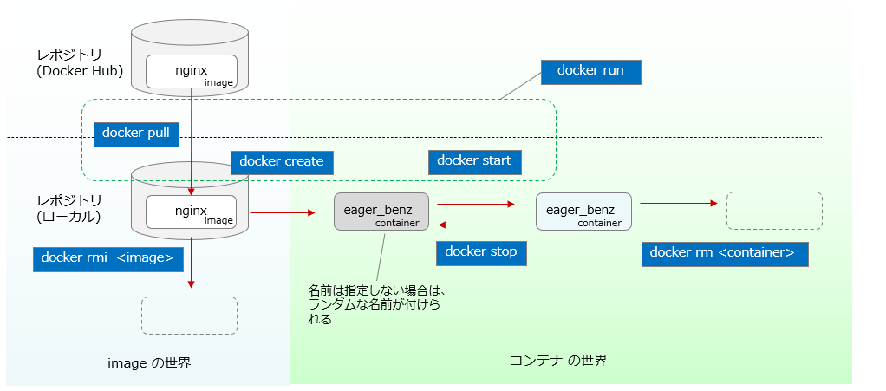
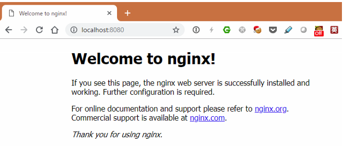
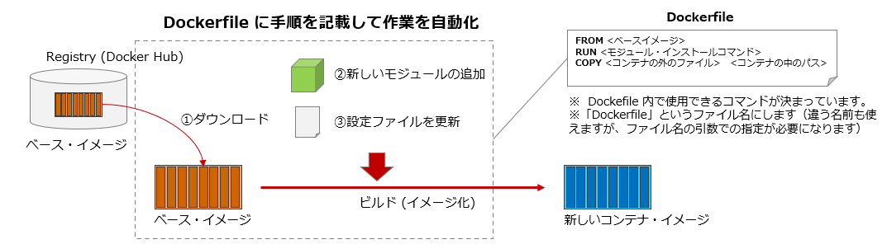

:toc: left
:toclevels: 5
:sectnums:

== はじめに

公式を含め、世の中にたくさん Docker のチュートリアルがありますが、自分の昔の作業メモを中心に内容を整理して解説を加えたら、必要最低限をおさえた実践的なものができるのではないだろうか。という発想で作って見ました。

決して網羅的ではなく、文中で使ってないコマンドについて一覧のリストを作ったりもしていません。それは「こういう事はできないのかな」と思った時に、 https://docs.docker.com/get-started/overview/[公式の Docker docs^] や、 https://docs.docker.jp/[翻訳版の Docker docs^] 、 https://www.google.com/[グーグル検索^] で見つけてもらって、その代わりに文章量を減らして読みやすくしよう。という発想です。(それでも書いてみると、結構、長くなりました…）

人によって必要な知識の範囲は違うと思いますが、お役に立ててれば幸いです。

== とりあえずコンテナを動かす

=== コンテナを実行する環境を作る

コンテナの実行環境として、 `Docker Desktop` を使用します。 `Windows` 版、 `Mac` 版がありますが、以下からダウンロードします。

個人用であれば無償です。

https://www.docker.com/products/docker-desktop

何が一番楽でお金がかからないだろうか。と考えた結果、 `Mac` でも `Windows` でも共通に使えて、作業も楽なので、 `Docker Desktop` を選択してみました。
`Linux` の仮想マシンを立てて、そこで `docker` を動かすなど選択肢はたくさんあると思いますのでお好きなもので構いません。

このドキュメントを書いた、筆者の環境は 「Windows 10」 + 「Docker Desktop for Windows」 + 「WSL2」 です。

=== コンテナを動かしてみる

例として、 `nginx` のコンテナを動かしてみます。このコンテナは https://hub.docker.com/[Docker Hub^] 上に既にあるものを使用します。

コンテナは覚えなければいけない概念などがいろいろありますが、細かい話は後に譲るとして、このセクションでは、まずは単純に動かしてみて、「雰囲気」を掴んでみる事にしてみます。

`Docker Hub` から `nginx` のイメージをダウンロードして、コンテナを実行するには以下のコマンドを実行します。

```
docker run nginx
```

これだけです。ただこれだと

```
$ docker run nginx
<省略>
2021/11/18 07:46:52 [notice] 1#1: nginx/1.21.3
2021/11/18 07:46:52 [notice] 1#1: built by gcc 8.3.0 (Debian 8.3.0-6)
2021/11/18 07:46:52 [notice] 1#1: OS: Linux 4.19.84-microsoft-standard
2021/11/18 07:46:52 [notice] 1#1: getrlimit(RLIMIT_NOFILE): 1048576:1048576
2021/11/18 07:46:52 [notice] 1#1: start worker processes
2021/11/18 07:46:52 [notice] 1#1: start worker process 31
2021/11/18 07:46:52 [notice] 1#1: start worker process 32
2021/11/18 07:46:52 [notice] 1#1: start worker process 33
2021/11/18 07:46:52 [notice] 1#1: start worker process 34
2021/11/18 07:46:52 [notice] 1#1: start worker process 35
2021/11/18 07:46:52 [notice] 1#1: start worker process 36
2021/11/18 07:46:52 [notice] 1#1: start worker process 37
2021/11/18 07:46:52 [notice] 1#1: start worker process 38
2021/11/18 07:46:52 [notice] 1#1: start worker process 39
2021/11/18 07:46:52 [notice] 1#1: start worker process 40
2021/11/18 07:46:52 [notice] 1#1: start worker process 41
2021/11/18 07:46:52 [notice] 1#1: start worker process 42
```

のようにプロンプトが戻ってこないので **「Ctrl + C」で処理を停止してください。**

次に `-d` オプションを付けた、以下を実行してみます。

```
$ docker run -d nginx
b0d570e09018fac53c58db702ca09c7689b200bd58bf3fad79748d240a8e3129
$
```

今度はプロンプトが戻ってきたと思います。ここで使われている `-d` 「デタッチ」を意味します。先ほど、 `-d` を付けなかった時にプロンプトが返ってこなかった事と較べると、なんとなく「デタッチ」の感覚がつかめると思います。

==== 稼働中のコンテナの確認

起動中のコンテナを確認するには、 `docker ps` を実行します。

```
$ docker ps    # 起動中のコンテナの確認
CONTAINER ID   IMAGE     COMMAND                  CREATED         STATUS         PORTS     NAMES
b0d570e09018   nginx     "/docker-entrypoint.…"   5 seconds ago   Up 3 seconds   80/tcp    eager_benz
$
```

`ps` からイメージできるように、稼働中のコンテナをリストしてくれます。
一つのコンテナが起動しているのがわかると思います。コンテナが仮想マシンとは違い「隔離されたプロセス」である事をなんとなく示唆してくれるコマンド名になっています。

一番後ろの `NAMES` のコラムを見ると `eager_benz` と名前が付いてます。
この名前は自分が指定した名前も付ける事ができますが、**ユーザーが指定しなければ勝手につけられます。**
ランダムな名前は、「形容詞」+「著名人の名前」の形で生成されています。namesgenerator というパッケージで生成されておりソースは https://github.com/moby/moby/blob/master/pkg/namesgenerator/names-generator.go[こちら^] です。

`CONTAINER ID (b0d570e09018)` と `NAME (eager_benz)` は、自動で付けられるユニークな値で、コンテナの停止や開始時に識別子として使用する事ができます。

==== コンテナ名でコンテナを停止

コンテナを停止するには、 `docker stop <コンテナ名 | CONTAINER ID>` を使用します。
まずはコンテナ名を指定して停止させてみます。

```
$ docker stop eager_benz   # 起動したコンテナの停止
eager_benz
$
```

`docker ps` で、起動しているコンテナが居ない事の確認

```
$ docker ps  
CONTAINER ID   IMAGE     COMMAND   CREATED   STATUS    PORTS     NAMES
$
```

==== コンテナIDでコンテナを停止

さっきは `eager_benz` というコンテナ名を指定してを停止させましたが、 `CONTAINER ID` を使って以下のように停止させる事もできます。

```
$ docker stop b0d570e09018     # 最後の IDは docker ps で表示されていた CONTAINER ID
```

停止したコンテナは完全に消えたわけではなく、停止した状態で残っています。以下のコマンドで停止中のコンテナを表示させる事ができます。

```
$ docker ps -a
CONTAINER ID   IMAGE                                                     COMMAND                  CREATED          STATUS                      PORTS                  NAMES
b0d570e09018   nginx                                                     "/docker-entrypoint.…"   20 minutes ago   Exited (0) 5 minutes ago                           eager_benz
$ 
```

`CONTAINER ID` や、 `NAMES` の欄の値が起動していた時と同じ値である事を確認して下さい。

==== 停止したコンテナの削除

完全にコンテナを消去するには、`docker rm  <コンテナ名 | CONTAINER ID>` を使用します。

```
$ docker rm eager_benz
eager_benz
```

コンテナが消えたか確認します。

```
$ docker ps -a
CONTAINER ID   IMAGE                                                     COMMAND                  CREATED          STATUS                      PORTS                  NAMES
$
```

==== イメージのリスト

コンテナは消えましたが、コンテナの元になったイメージ `nginx` は、そのまま残っています。
イメージを確認するには `docker images` で確認します。

```
$ docker images
REPOSITORY                                                TAG       IMAGE ID       CREATED         SIZE
nginx                                                     latest    ea335eea17ab   1 weeks ago     141MB
$
```

コンテナの `イメージ` と、それから作成される `コンテナ` の関係がなんとなく理解できたかなと思います。

`イメージ` と `コンテナ` は、大半のコンテキストで同じ意味の言葉として使用でき、合体させて `コンテナ・イメージ` 等と曖昧に使うケースもありますが、 `docker` コマンドの世界では、 `dockerイメージ` と `dockerコンテナ` は、明確に違うものを示します。

関係を図示すると以下のようになります。

image::images/1-2-image-and-container.png[align="left"]

docker `イメージ` から作成されるのが docker `コンテナ` になります。


==== イメージの削除

イメージを削除するには、`docker rmi <REPOSITORY名:TAG>` で削除します。

```
$ docker rmi nginx:latest
Untagged: nginx:latest
Untagged: nginx@sha256:097c3a0913d7e3a5b01b6c685a60c03632fc7a2b50bc8e35bcaa3691d788226e
Deleted: sha256:ea335eea17ab984571cd4a3bcf90a0413773b559c75ef4cda07d0ce952b00291
Deleted: sha256:cc284e9b1cbed75793782165a07a0c2139d8ec0116d1d562c0e2e504ed586238
Deleted: sha256:6207e091bef7f1c94a109cb455ba163d53d7c2c641de65e71d3a0f33c0ebd8ae
Deleted: sha256:97a18ff8c6973f64d763f004cad932319a1428e0502c0ec3e671e78b2f14256b
Deleted: sha256:319130834f01416a2e8f9a4f2b2fa082c702ac21f16e0e2a206e23d53a0a3bae
Deleted: sha256:1bc375f72973dc110c9629a694bc7476bf878d244287c0214e6436afd6a9d1b0
$
```

dockerの世界では、 `TAG` も名前の一部で、イメージを削除する時は `TAG` も指定する必要がある事に注意して下さい。

=== レポジトリとタグとイメージ名

ここでは「レポジトリ」名、「タグ」名、「イメージ」名について、少し考えて見ます。

`docker images` の出力をよく見てみます。

```
$ docker images
REPOSITORY                                                TAG       IMAGE ID       CREATED         SIZE
nginx                                                     latest    f652ca386ed1   3 weeks ago     141MB
nginx                                                     1.20      aedf7f31bdab   5 weeks ago     141MB
redhat/ubi8                                               latest    cc0656847854   7 weeks ago     216MB
ubuntu                                                    latest    ba6acccedd29   2 months ago    72.8MB
```

ヘッダー部分の所に `REPOSITORY` と書いています。

少し前のステップで、イメージの削除は `docker rmi <REPOSITORY名:TAG>` で行う。とさらっと書きましたが、直感的には `イメージ名` で良いような気もします。この `REPOSITORY` とは何でしょうか。

イメージは `latest` や、 `1.0` 等のバージョンを表す `タグ` を付ける事で、同じグループのイメージである事を示す事ができます。 `docker` では、このグループの概念を `レポジトリ` と読んでいます。

image::images/1-3-repository.png[left]
ですので、 `docker images` の出力では、 `イメージ名` ではなく `レポジトリ` という表現になっています。

`レポジトリ名` だけでは、イメージを任意に区別できないので、 `レポジトリ` 名 + `タグ` 名の形で `docker` コマンドの引数に指定するのが殆どです。

====  ユニークなイメージ

また、忘れてはいけないのは `IMAGE ID` でもイメージを区別できます。
`IMAGE ID` が同じでも違う `レポジトリ` 名 + `タグ` 名を持つイメージも存在します。以下の例は、あるイメージを別のイメージにコピーし作成した時の出力例です。同じ `IMAGE ID` を持っています。

```
$ docker images
REPOSITORY                                                TAG       IMAGE ID       CREATED         SIZE  
copy                                                      1.0       6c364457d832   3 days ago      303MB 
nginx-ubi8                                                1.0       6c364457d832   3 days ago      303MB 
...
```

`docker` の世界では、一意に決まるユニークなイメージを想像した時に、 `レポジトリ` 名 + `タグ` 名 としての一意なのか、 `IMAGE ID` として一意なのか2通りがあります。


====  Docker のイメージ名とは？

Docker のマニュアルを `イメージ名(image name)` で検索すると、 `imagne name` という言葉の使われている場所は非常に少ないのですが、例えば、 https://docs.docker.com/engine/reference/commandline/inspect/#get-an-instances-image-name[Get an instance’s image name^] で紹介されている `docker inspect` コマンドで得られる `imagne name` とされるものは `tag` を含んだ値が得られます。(タグがlatestの場合は省略)。

```docker
$ docker inspect --format='{{.Config.Image}}' c3775755f851
nginx:1.20
$ 
```

ただ、一般的には `タグ` を抜いた `レポジトリ名` の事を `イメージ` 名と呼ばれるケースもあり、 `イメージ(名)` の定義はきちんと定まっておらず曖昧に使われているのが現状です。ここは初学者にはツライ所です。

以下は `docker tag` コマンドのヘルプですが、 `レポジトリ名` と解釈される所は `SOURCE_IMAGE/TARGET_IMAGE` と記載されていて `[:TAG]` を付ける事ができるとされています。つまり、ここでは `SOURCE_IMAGE/TARGET_IMAGE` 名が `REPOSITORY` 名と同じ意味で使われています。

```
$ docker tag --help
Usage:  docker tag SOURCE_IMAGE[:TAG] TARGET_IMAGE[:TAG]
```

また、実際のコマンドラインで `docker run nginx` と書いた時の `nginx` は、(レポジトリ名+タグ名)です。これは省略されているだけで `nginx:latest` を指します。ですので、タグが無い=レポジトリ名という区別も単純にはできません。

`docker` では、省略した記述が許されているため `nginx` と書いた時にそれはコンテキストによって `レポジトリ` であったり、 `イメージ名` でもありえます。さらに前述した `docker tag` コマンドのヘルプのように、タグを抜いた部分を「イメージ」と呼んでいるケースもあります。

はじめのうちは混乱する部分なので、頭を柔軟に保つ必要があります。

このガイドでは基本的に `<レポジトリ名>:<タグ>` の組み合わせを `イメージ` 名と呼ぶ事にします。

=== このセクションで使用したコマンド

初めのうちはコマンドを覚えられないと思うので、このセクションで使用した基本的なコマンドをまとめておきます。

イメージ名 `nginx` (タグを省略しているので `nginx:latest` と解釈される)を `Docker Hub` からダウンロードして、 `-d (デタッチ）` で起動。コンテナ名は自動でランダム付ける

```
docker run -d nginx
```

起動しているコンテナの一覧

```
docker ps
```

起動しているコンテナを停止

```
$docker stop eager_benz   # eager_benz は自動でランダムに付けられたコンテナ名
```

停止したものも含めたコンテナの一覧

```
docker ps　-a 
```

コンテナの削除

```
docker rm eager_benz　　 # eager_genz はコンテナ名
```

イメージの削除

```
docker rmi nginx:lattest   # nginx:latest はイメージ名
```


== コンテナを使う上での暗黙の了解とPULL

ここでは、演習に入る前に、少し寄り道して `docker pull` について学んでみます。

=== Docker Hub 上のイメージを使用する

単純にコンテナをダウンロードするだけであれば、

```
docker pull nginx
```

でダウンロード(`PULL`)する事ができます。

`docker run` というコマンドを前の章で使いましたが、実は、 `docker run` コマンドは `docker pull` と `docker create` と `docker start` の3つのコマンドをまとめたコマンドです。

以下に `docker` で良く使うコマンドの関係性を図示してみました。



`docker run` が、`pull` `create` `start` をまとめたものである事がわかると思います。

既にローカルに `pull` されたイメージがある場合は、`docker run` を実行してもインターネットから再ダウンロード( `pull` )される事はありません。

`create` と `start` はとりあえず置いておいて、ここでは `pull` に注目します。


```
docker pull nginx
```


では、単に `nginx` と指定していますが、幾つかの暗黙の省略が含まれています。

`docker` コマンドでは、 `nginx` と指定しただけで https://hub.docker.com[Docker Hub^] というコンテナレジストリにアクセスして、 `nginx` という名前のコンテナで `latest` というタグが付いたものを探してダウンロード( `pull` )してきます。

なので省略されていますが、上のコマンドは以下のものと同じになります。

```
docker pull nginx:latest
```

タグは、 `:(コロン)` を挟んで付加します。タグの `latest` 部分は、 `1.20` のようにバージョンを付ける事もあります。

```
docker pull nginx:1.20
```

`Registry` 上のイメージにどんなタグが付いているかの一覧の取得は、標準の `docker` コマンドではサポートされておらず、 https://registry.hub.docker.com/_/nginx?tab=tags[Docker Hub^] にアクセスして確認する必要があります。


=== Docker Hub 以外のイメージを使用する

コンテナのイメージを  https://hub.docker.com[Docker Hub^] 以外のレジストリからダウンロード(`pull`)してきたい場合は、明示的に指定する必要があります。例えば、

```
docker run quay.io/centos/centos
```

は、 `quay.io` という `Red Hat` 社のコンテナレジストリの `centos/centos` というコンテナイメージの `latest` タグが付いたものを(ローカルに無ければ) ダウンロード( `pull` )して実行します。

上記のコマンドは以下と同じになります。

```
docker run quay.io/centos/centos:latest
```

ダウンロードしてきた `nginx` というイメージは、ローカルに保存され、次回、同じイメージが要求された時には、既にダウンロードされたものが使用されます。

== 演習1: Nginx のコンテナを起動する

こんどは、もう少しきちんと、コンテナを作成してみます。`docker run -d nginx` にもう少しオプションを足してみます。

以下のコマンドで、イメージ「`nginx`」から、コンテナ「`my-nginx`」が作成され起動します。

```
 docker run -d -p 8080:80  --name  my-nginx   nginx
```

オプションについて解説します。これらは基本的なオプションなので暗記する必要があると思って下さい。

**-d**
これは「デタッチ」モードを意味します。前のステップで `docker run nginx` を実行した時に、作業中のコンソールにカーソルが戻ってこなかったのを覚えていると思います。このオプションを付ける事で、コンテナを今使っているコンソールから切り離す(デタッチ)する事ができます。

**-p 8080:80**
コンテナは、言うなれば、ただのプロセスです。同じ `OS` 上で同じポート番号を使用する複数のプロセスがあると、ポートの取り合いが起きて上手く動く動きません。

image::images/practice1-port.png[left]


上記のコマンドでは、OSから見たコンテナのポート「 `8080` 」をコンテナ内の「 `80` 」番ポートにフォワードする設定をしています。これにより既に OS上に `80` 番ポートを使うアプリケーションが稼働している場合の(多くの場合ありがちです) 競合を避けています。反対に「 `8080` 」はそのOS上で使われてなければ、他の任意のポート(例えば `8090` ) でも大丈夫です。

同じホストOS上でたくさんのコンテナを使うには、同じIPアドレスを使う事になるので、ポートの衝突を避ける必要があります。
個別にIPアドレスを持つ VM(仮想マシン)では、ポートが同じでもIPが違うのでアプリケーションのポートが衝突する事はありません。アプリケーション(コンテナ）のポートを変更するという考え方は、コンテナならではの作法になります。

コンテナ内で `80` 番ポートを使うのは、この `nginx` のイメージが `80` を `LISTEN` するように作られているという暗黙の了解によるものです。もし全く知らないアプリケーションで、どこにもどのポートを `LISTEN` しているか記述されてない場合は全く検討がつかないものになります。

**--name  my-nginx**
イメージ `nginx` を元に作成するコンテナ名を指定します。特に指定しない場合はランダムな名前が付けられます。以前の実験では、何も指定しなかったために `docker` によって `eager_benz` と言う名前が付けられていました。

**nginx**
コンテナ `my-nginx` の元になるイメージ名です。これは暗黙の了解で、 `Docker Hub` 上の `nginx:latest` が検索されて使用されます。 `Docker Hub` 以外のレジストリ上のイメージを指定するには、明示的にそのレジストリ名を指定する必要があります。


実際の実行結果は以下になります。

```
$ docker run -d -p 8080:80  --name  my-nginx   nginx
e0cc77bc866fe504b8053a7b201b7a469ec61d98a4fd3a6618be382e87fda34c

$
```

コマンドプロンプトにカーソルが戻ってきました。 `-d` オプションのおかげです。

もう一度、上記のコマンドの引数を軽くおさらいしておきます。これはコンテナをやって行く以上覚えなければいけないものなので、頭にたたきこんでおきましょう。

[NOTE]
====
**-d** : デタッチ。コンテナの起動後に、コンテナと今使っているコンソールを切り離します。 +
**-p** : 8080:80  8080番ポートへのアクセスを、コンテナの80番ポートにフォワードする。 +
**--name** :  my-nginx   イメージ「nginx」を元に作る自分のコンテナの名前。 +
**nginx** : コンテナの元になるイメージ(この場合、インターネット上の Docker Hub 上に置かれているイメージ)
====

=== 実行中のコンテナの確認 

実行中のコンテナは、以下のコマンドで確認できます。

```
docker ps
``` 

実際の実行結果は以下の通りです。


```
$ docker ps
CONTAINER ID   IMAGE                       COMMAND                  CREATED          STATUS                      PORTS                  NAMES
7e7ffed26222   nginx                      "/docker-entrypoint.…"   33 minutes ago   Up 9 minutes                0.0.0.0:8080->80/tcp   my-nginx
$
```

次にこのコンテナに、ブラウザを使ってアクセスしてみます。アクセスポートは、コンテナ作成時に指定した `8080` になります。コンテナ外部の `8080` ポートからコンテナ内部の `80` ポートにフォワードされます。



無事アクセスできました。

毎回ブラウザを立ちあげるのも大変なので、CLIツールの `curl` を使ってアクセスにも慣れておきます。以下でアクセスできます。

```
curl localhost:8080
```

実際に実行してみます。

```
$ curl localhost:8080
<!DOCTYPE html>
<html>
<head>
<title>Welcome to nginx!</title>
<style>
html { color-scheme: light dark; }
body { width: 35em; margin: 0 auto;
font-family: Tahoma, Verdana, Arial, sans-serif; }
</style>
</head>
<body>
<h1>Welcome to nginx!</h1>
<p>If you see this page, the nginx web server is successfully installed and
working. Further configuration is required.</p>

<p>For online documentation and support please refer to
<a href="http://nginx.org/">nginx.org</a>.<br/>
Commercial support is available at
<a href="http://nginx.com/">nginx.com</a>.</p>

<p><em>Thank you for using nginx.</em></p>
</body>
</html>

$
```

出力結果が大量にでますが、これは HTML のテキストがそのままコマンドプロンプトに表示されているためです。
コンソールは、ブラウザのように HTMLを解釈する機能ないためこのような出力になります。

=== コンテナを停止する

以下のコマンドで起動中のコンテナを停止する事ができます。

```
docker stop <コンテナ名>
```

実際に停止してみます。

```
$ docker stop my-nginx
my-nginx
$ 
```

=== 稼働中のコンテナを確認する

**docker ps**

`dcoker ps` コマンドで稼働中のコンテナを確認してみます。 `my-nginx` は表示されないはずです。

```
$ docker ps
CONTAINER ID   IMAGE     COMMAND   CREATED   STATUS    PORTS     NAMES

$
```

**docker ps -a**

`docker ps` に `-a` オプションを付けた `docker ps -a` を使うと、既に停止したコンテナも確認できます。

```
docker ps -a
```

実際に `docker ps -a` を実行してみます。

```
$ docker ps -a
CONTAINER ID   IMAGE                    COMMAND                  CREATED         STATUS                          PORTS     NAMES　                                  "/docker-entrypoint.…"   8 minutes ago   Exited (0) About a minute ago             my-nginx
```

`STATUS` が `Exited (0)` になったコンテナ `my-nginx` が確認できます。

=== 停止しているコンテナを起動する

停止したコンテナは再度、起動させる事ができます。 `docer start <コンテナ名>` で起動できます。

```
docker start <コンテナ名>
```

実際にコンテナを起動してみます。

```
$ docker start my-nginx
my-nginx
$
```

コンテナの起動を `dokcer ps` コマンドで確認してみます。

```
$ docker ps
CONTAINER ID   IMAGE     COMMAND                  CREATED          STATUS          PORTS                  NAMES
e0cc77bc866f   nginx     "/docker-entrypoint.…"   15 minutes ago   Up 35 seconds   0.0.0.0:8080->80/tcp   my-nginx
$

```

以上で演習1は完了です。


== 演習2:  OSのコンテナの実行

演習1では `nginx` のコンテナを実行しました。

こんどは、先ほどの `nginx` のようなアプリケーションが何もインストールされてない素の `OS` のイメージからコンテナを作成してみます。
`Docker Hub` にあるる `ubuntu` のイメージを元にコンテナを作成・実行してみます。名前は `my-ubuntu` にします。

```
$ docker run --name my-ubuntu  ubuntu

Unable to find image 'ubuntu:latest' locally
latest: Pulling from library/ubuntu
7b1a6ab2e44d: Pull complete
Digest: sha256:626ffe58f6e7566e00254b638eb7e0f3b11d4da9675088f4781a50ae288f3322
Status: Downloaded newer image for ubuntu:latest

$
```

ここでは、単にイメージ名として `ubuntu` とだけ指定しているので、 `Docker Hub` で公開されている https://hub.docker.com/_/ubuntu[ubuntu^] の `latest` のタグが付いたイメージがダウンロード( `pull` )されます。

稼働しているかどうか `docker ps` で確認してみます。

```
$ docker ps
CONTAINER ID   IMAGE     COMMAND   CREATED   STATUS    PORTS     NAMES

$
```

稼働してからすぐに Exit している事がわかります。

今度は `docker ps -a` を使用して、停止したコンテナも確認してみます。

```
$ docker ps -a
CONTAINER ID   IMAGE                                                     COMMAND                  CREATED          STATUS                      PORTS                  NAMES
10b401288650   ubuntu                                                    "bash"                   1 minutes ago   Exited (0) 1 minutes ago                          my-ubuntu

$
```

これを見ると `bash` が一瞬実行されたものの、すぐに終了した事がわかります。このようにコンテナでは、フォアグラウンドで稼働するプロセスが無いとすぐに終了してしまいます。

イメージの作りがどのようになっているかは、 https://hub.docker.com/layers/ubuntu/library/ubuntu/latest/images/sha256-f3113ef2fa3d3c9ee5510737083d6c39f74520a2da6eab72081d896d8592c078?context=explore[Docker Hub^] のページで確認ができますが、 `CMD["bash"]` と書かれており、これはコンテナ起動時に `bash` が実行されるように作られている事を意味します。が、この `bash` は、特にする事もないので、プロセスとしてはすぐに終了します。

image::images/practice2-ubuntu-image.png[left]

演習1では `nginx` がフォアグラウンドで稼働していたのでコンテナが稼働し続けてましたが、稼働し続けるプロセスが無いとこのようにコンテナ自体が終了してしまいます。

今度は、 `-itd` という起動オプションを付けて `my-ubuntu2` という名前のコンテナを作ります。

```
docker run -itd --name my-ubuntu2 ubuntu 
```

ここで `-itd` というオプションは、使っていると意味をだんだんと忘れてしまい手が勝手に動くようになりますが、以下のような意味があります。

=== オプション -itd 
`-i` : interactive. Keep STDIN open even if not attached. + 
`-t` : Allocate a pseudo-TTY. コンテナに疑似tty(pseudo-TTY)を作る。 +
`-d` : Run container in background and print container ID. デタッチ。コンテナをバックグラウンドで動かす。

これらはバラバラのオプションなので `-it -d` や、 `-i -t -d` のようにバラバラに指定もできます。
殆どの用途で `-it` はセットで使われ、 `-it` や `-itd` のように使われます。

`-i` と `-t` は、コンテナと、自分が使っているホスト上のコンソールが、コンテナと通信できるようにセットアップするためのオプションです。
`-it` は、今は、ひとかたまりに自分のコンソールからコンテナ内部を覗いて見るのに必要なオプション。と覚えておきましょう。

次に、 `docker ps` コマンドでコンテナの稼働を確認してみます。

```
$ docker ps
CONTAINER ID   IMAGE     COMMAND       CREATED         STATUS         PORTS     NAMES
34d28c35a11b   ubuntu    "bash"   5 minutes ago   Up 5 minutes             my-ubuntu2

$
```

今度はコンテナが稼働したままです。

=== なぜコンテナが起動したままなのか

`-t` オプションは、コンテナに、pts(疑似端末)を作るオプションです。疑似端末が作成され、起動した `bash` がインタラクティブモードで接続した状態になります。この `bash` が起動したままになるため、コンテナが終了せずに稼働し続ける事ができるようになっています。

=== docker attach でコンテナの中を覗く

コンテナ `my-bunutu2` の中を覗いてみます。
これは `docker attach  <コンテナ名 | CONTAINER ID>` で可能です。

```
docker attach my-ubuntu2
root@34d28c35a11b:/# ps -ef                       
UID        PID  PPID  C STIME TTY          TIME CMD
root         1     0  0 04:57 pts/0    00:00:00 bash
root        17     1  0 05:06 pts/0    00:00:00 ps -ef
root@34d28c35a11b:
```

コマンドプロンプトが変わり、コンテナ内に入った事がわかります。
同時に `ps -ef` コマンドを実行すると、 `bash` と自分自身である `ps -ef` しか動いてない事がわかります。
`ps -ef` の親のプロセスは `PID=1` の `bash` である事がわかります。

**コンテナにはログインの概念が無い**ので、この `attach` というのはコンテナ独特の考え方になります。
ログイン時に新規に `bash` 等のシェルが起動する Linux の通常のログインの仕組みと違い、既に動いていた `bash` を使用しています。

次にこの `bash` 上で `exit` をしてみます。

```
root@34d28c35a11b:/# exit
exit

$
```

`exit` すると、はじめに動いていた `bash` からも `exit` してしまってコンテナが停止します。

`docker ps` でコンテナが終了している事を確認します。

```
$ docker ps
CONTAINER ID   IMAGE     COMMAND   CREATED   STATUS    PORTS     NAMES

$
```

=== docker exec でコンテナの中を覗く

先ほどのステップで停止してしまったコンテナを `docker start` コマンドで、再度起動します。

```
$ docker start my-ubuntu2
```

今度は、`docker exec` というコマンドでコンテナの中を覗きます。

正確には `docker exec` は、起動中のコンテナ内で新しいプロセスを起動するプロセスです。コンテナ内で起動する新しいプロセスを引数で指定する必要がありここでは `/bin/bash` を指定します。


```
$ docker exec -it my-ubuntu2 /bin/bash
root@34d28c35a11b:/# ps -ef
UID        PID  PPID  C STIME TTY          TIME CMD
root         1     0  0 05:15 pts/0    00:00:00 bash
root        21     0  0 05:18 pts/1    00:00:00 /bin/bash
root        29    21  0 05:18 pts/1    00:00:00 ps -ef
root@34d28c35a11b:/#
```

中で `ps -ef` コマンドを実行すると、今度は3つのプロセスが動いており `ps -ef` の親プロセス IDは `PID=21` です。つまり `PID=21` が `docker exec` によって新規に起動された `bash(/bin/bash)` です。

この `bash(/bin/bash)` が接続している `TTY` は `pts/1` になっていて、コンテナ内にもともと存在している `pts/0` とは別である事がわかります。

コンテナから `exit` してみます。

```
root@34d28c35a11b:/# exit
exit

$
```


`docker ps` で確認すると、 `attach` でコンテナに接続した時とは違い、コンテナがまだ稼働したままである事がわかります。

```
$ docker ps
CONTAINER ID   IMAGE     COMMAND       CREATED          STATUS         PORTS     NAMES
34d28c35a11b   ubuntu    "/bin/bash"   23 minutes ago   Up 5 minutes             my-ubuntu2

$
```

`docker exec` では新規に `/bin/bash` をコンテナ内で起動したので、`exit` で終了したのは新規に起動した `/bin/bash` だけになります。

一方で `docker attach` では、元々、 `-t` オプションを付けた事でコンテナ内で起動していたシェルに接続( `attach` )し、そのシェルを `exit` してしまったため、他にプロセスがなくなりコンテナが終了してしまいました。

なんとかく `attach` と `exec` のそれぞれで、コンテナの中を見る時の動きの違いがわかったと思います。

以上で演習2は完了です。お疲れ様でした。

== 演習3: オリジナルの nginx のイメージを作る

=== 手動作業によるイメージのビルド


`Docker Hub` からダウンロードした `親イメージ` に、自分のアプリケーションとファイルを追加して新しいイメージを作ります。

ここで行う作業の流れを図示すると以下の通りです。

image::images/practice3-procedure.png[left]

`親イメージ` に、ファイルを追加したり、コンテナ実行時のコマンドを設定して、新しい `イメージ` を作る事を `ビルド` と言います。

この `親イメージ` として、Linuxベンダーが提供している `ベース・イメージ` を `Docker Hub` から取得する所からはじめます。

通常、コンテナの `イメージ` は、一つの `親イメージ` に修正を積みかさねる事で新しい `イメージ` を作っていきますが、 `ベース・イメージ` とは、それ以上の親がいない大元の `イメージ` を指します。

===  ベース・イメージをダウンロードする

ここでは `Red Hat` が提供する `RHEL8` のベースイメージである `ubi8` を `Docker Hub` からダウンロード( `pull` )して使用します。

image::images/practice3-redhat-ubi8.png[left]

`Docker Hub` 上の `redhat/ubi8` のレポジトリへの https://hub.docker.com/r/redhat/ubi8/tags[リンクはこちら^] です。

イメージを作成する場合は、適当なイメージを使用するとマルウェアなどが含まれている可能性があるので、提供元のわかっているイメージを使用するようにしましょう。

以下のコマンドを実行して、 `Red Hat` 社の `UBI` イメージをダウンロード( `pull` )します。

```
$ docker pull redhat/ubi8
```

特にドメイン名を指定していませんが、お約束として `Docker Hub` に `redhat/ubi8` を探しに行って `pull` しています。

`pull` した `イメージ` を `docker images` コマンドで確認します。

```
$ docker images
REPOSITORY                                                TAG       IMAGE ID       CREATED        SIZE
redhat/ubi8                                               latest    cc0656847854   7 days ago     216MB
$
```

`pull` したイメージを元に `nginx-ubi8` という名前のコンテナを作成します。


```
$ docker run -dit -p 8080:80 --name nginx-ubi8 redhat/ubi8:latest
```

`docker ps` で起動を確認します。

```
$ docker ps
CONTAINER ID   IMAGE                COMMAND       CREATED         STATUS         PORTS                  NAMES
76304e983f34   redhat/ubi8:latest   "/bin/bash"   4 seconds ago   Up 3 seconds   0.0.0.0:8080->80/tcp   nginx-ubi8
$
```

`docker exec` コマンドを使い、コンテ内に新規にシェルを起動しコンテナの中に入ります。

```
$ docker exec -it nginx-ubi8  /bin/bash
[root@76304e983f34 /]#
```

コンテナの中に入ると、プロンプトが `$` から `[root@76304e983f34 /]` 等に変わっているはずです。

この `コンテナ` には特に何もアプリケーションがインストールされていないので、インストールしていきます。

ここからの作業は普通の `Linux` と殆ど同じです。

=== yum で nginx をインストール

コンテナ内で、 `yum` コマンド等で `nginx` をインストールします。

```
yum install -y nginx
```

=== nginx.conf を編集して 標準出力にログを吐くように変更

`nginx.conf` (nginxの構成ファイル）の編集は、コンテナを動かす事だけ考えるのであれば必須ではないですが、将来必ず通る道なので、コンテナ向きに少しカスタマイズします。

`コンテナ` では、 `コンテナ` 内のファイルシステムに書き込まれたデータは、 `コンテナ` の削除時に消えてしまいます。

基本的に `コンテナ` は作って、廃棄して、また作って。を繰り返すものなので、保存したいデータは `コンテナ` の外に書き出す作法になっています。ログも残したい場合は、その作法に従います。

`Docker` では標準出力と標準エラー出力を `コンテナ` を動かしているホスト上に残す事ができ、吐き出したログは `docker logs` コマンドでホスト上で確認できます。

`nginx` の構成ファイルである `nginx.conf` を編集して、 `nginx` のログを標準出力、標準エラー出力に書き出すように編集します。


編集は `vi` で行います。 `vi` の使い方はここでは省略します。

```/etc/nginx/nginx.conf
# For more information on configuration, see:
#   * Official English Documentation: http://nginx.org/en/docs/
#   * Official Russian Documentation: http://nginx.org/ru/docs/

user nginx;
worker_processes auto;
# error_log /var/log/nginx/error.log;
error_log /dev/stderr; #(1) stderrに出力先を変更
pid /run/nginx.pid;

# Load dynamic modules. See /usr/share/doc/nginx/README.dynamic.
include /usr/share/nginx/modules/*.conf;

events {
    worker_connections 1024;
}

http {
    log_format  main  '$remote_addr - $remote_user [$time_local] "$request" '
                      '$status $body_bytes_sent "$http_referer" '
                      '"$http_user_agent" "$http_x_forwarded_for"';

    access_log  /dev/stdout  main; #(2) stdoutに出力先を変更する

    sendfile            on;
    tcp_nopush          on;
    tcp_nodelay         on;
    keepalive_timeout   65;
    types_hash_max_size 2048;

    include             /etc/nginx/mime.types;
    default_type        application/octet-stream;

    # Load modular configuration files from the /etc/nginx/conf.d directory.
    # See http://nginx.org/en/docs/ngx_core_module.html#include
    # for more information.
    include /etc/nginx/conf.d/*.conf;

    server {
        listen       80 default_server;
        listen       [::]:80 default_server;
        server_name  _;
        root         /usr/share/nginx/html;

        # Load configuration files for the default server block.
        include /etc/nginx/default.d/*.conf;

        location / {
        }

        error_page 404 /404.html;
            location = /40x.html {
        }

        error_page 500 502 503 504 /50x.html;
            location = /50x.html {
        }
    }

# Settings for a TLS enabled server.
#
#    server {
#        listen       443 ssl http2 default_server;
#        listen       [::]:443 ssl http2 default_server;
#        server_name  _;
#        root         /usr/share/nginx/html;
#
#        ssl_certificate "/etc/pki/nginx/server.crt";
#        ssl_certificate_key "/etc/pki/nginx/private/server.key";
#        ssl_session_cache shared:SSL:1m;
#        ssl_session_timeout  10m;
#        ssl_ciphers PROFILE=SYSTEM;
#        ssl_prefer_server_ciphers on;
#
#        # Load configuration files for the default server block.
#        include /etc/nginx/default.d/*.conf;
#
#        location / {
#        }
#
#        error_page 404 /404.html;
#            location = /40x.html {
#        }
#
#        error_page 500 502 503 504 /50x.html;
#            location = /50x.html {
#        }
#    }

}

```

ログの出力先の変更は2箇所で行ってます。
何かあった時もコンテナに入って確認してくも、コンテナの外からログを確認できるので便利です。

=== nginx の起動

コンテナ内で `nginx` を起動します。

```
nginx
```

このベースイメージには `ps` コマンドが入ってないのでここでは起動を確認せず、後でホストOSから `curl` でアクセス確認します。
`yum -y install procps` で `ps` コマンドをインストールするしてもOKですが、コンテナは基本的に小さく作る事が作法になっているので、できるだけ不要なものは入れないようにします。

=== コンテナからexit 

```
exit
```

=== nginx にアクセスできる事を確認

```
$ curl localhost:8080
```

=== コンテナ内にコンテナの外の index.html をコピー

デフォルトの `index.html` は、実験用としては少し懲りすぎているので、以下のようなシンプルな `index.html` ファイルをテキストエディタで作成します。

```index.html
<html>
    <head>
        <title>Test Page for the Nginx HTTP Server on Red Hat Enterprise Linux</title>
        <meta http-equiv="Content-Type" content="text/html; charset=UTF-8" />
    </head>
    <body>
       <p> Hello World </p>
    </body>
</html>
```

`docker cp` コマンドを使うとホストOS上のファイルを、コンテナ内にコピーできます。

以下のコマンドで、作成した `index.html` をコンテナ内の `/usr/share/nginx/html/index.html` に上書きします。


```
$ docker cp index.html nginx-ubi8:/usr/share/nginx/html/index.html
```

=== イメージを Commit

今、稼働している `コンテナ` 、 `nginx-ubi8` をイメージ化します。
イメージ名はタグ `1.0` を付加して `nginx-ubi8:1.0` とする事にします。

これは `docker container commit` というコマンドで実行できます。

```
$ docker container commit -c 'ENTRYPOINT ["nginx"]'  -c 'CMD ["-g","daemon off;"]'  nginx-ubi8  nginx-ubi8:1.0
```

ここで付けたオプションは以下の通りです。

`-c 'ENTRYPOINT ["nginx"]'` : ENTRYPOINTはコンテナ実行時に、実行するコマンドと引数です。コンテナ開始時にnginxが実行されます。
`-c 'CMD ["-g","daemon off;"]'` : CMDの指定値は、ENTRYPOINTの指定がある場合は、その引数となります。
`nginx-ubi8` : 生成するイメージの元になるコンテナ名です。
`nginx-ubi8:1.0` :コンテナから作成するイメージの名前です。

`-c` で指定している `ENTRYPOINT` や、`CMD` の少し難しく見えますが結果として、 `nginx -g "daemon off;"` というコマンドがコンテナ起動時に実行されて、 `nginx` が起動する事になります。

`daemon off` は、 `nginx` のオプションで、通常だとバックグラウンドプロセスとして稼働する `nginx` をフォアグラウンドプロセスとして実行するためのオプションです。

これはコンテナがフォアグラウンドプロセスが無いと終了してしまうために、通常バックグラウンドでデーモンとして稼働する `nginx` をフォアグラウンドプロセスにするためのオプションです。コンテナが稼働し続けるにはフォアグラウンドで稼働し続けるプロセスが必要です。

=== 作成したイメージの確認

イメージが作成されたか確認します。

```
$ docker images
REPOSITORY                                                TAG       IMAGE ID       CREATED         SIZE
nginx-ubi8                                                1.0       3b9b3870655f   5 seconds ago   303MB
redhat/ubi8                                               latest    cc0656847854   7 days ago           216MB
```

`nginx-ubi8` で、 `TAG` が `1.0` のつまり `nginx-ubi8:1.0` が作成されているのがわかります。


=== 自分が作成したイメージからコンテナを作る

自分が作成したイメージがきちんと使えるかコンテナを作って確認してみます。

イメージ名 `nginx-ubi8:1.0` を指定して以下のように実行します。
`8080` ポートが使ったコンテナが動いてなけれれば `8080` を使っても良いですが、今度は `8090` を使ってみます。

```
$ docker run -d -p 8090:80 --name my-ubi-nginx nginx-ubi8:1.0
```

`curl` で確認してみると以下のような出力が返ってくるはずです。

```
$ curl localhost:8090
<html>
    <head>
        <title>Test Page for the Nginx HTTP Server on Red Hat Enterprise Linux</title>
        <meta http-equiv="Content-Type" content="text/html; charset=UTF-8" />
    </head>
    <body>
       <p> Hello World </p>
    </body>
</html>
$
```


またアクセスログをコンテナ内のファイルに吐く設定から、標準出力に出すように変更したので、 `docker logs` コマンドで `nginx` のアクセスログが確認できるはずです。先ほど `curl` でアクセスしたので以下のようにログが出ているはずです。

```
$ docker logs my-ubi-nginx
172.17.0.1 - - [16/Dec/2021:08:06:39 +0000] "GET / HTTP/1.1" 200 305 "-" "curl/7.58.0" "-"
$
```

=== Docker Hubに push する。

せっかくなので作成したイメージを `Docker Hub` にアカウントを作って保管します。

1) https://hub.docker.com/[Docker Hub^] にアカウントを作ります。(詳細は省略します）
2) コマンドラインから Docker Hub にログインします。

```
$ docker login
Login with your Docker ID to push and pull images from Docker Hub. If you don't have a Docker ID, head over to https://hub.docker.com to create one.
Username: <username>
Password: 
Login Succeeded
$ 
```

3) Docker Hub 用の名前を付ける

ローカルで作成したイメージ `nginx-ibu8:1.0` に対して、レポジトリに保管するための別の名前を付けます。
`Docker Hub` に保管するための名前は、 `<username>` / `nginx-ibu8:1.0` のフォーマットである必要があります。

間に `/` が入る名前ははじめは少々気持ち悪いですが、 `Docker` の世界はこういうものだと割り切りましょう。

`docker tag` コマンドで以下のようにする事で、別の名前のイメージができます。

```
$  docker tag nginx-ubi8:1.0 <username>/nginx-ubi8:1.0
```

これで新しい名前のイメージができているはずです。
`docker images` を確認します。全く同じものですが、頭に `<username>` が付加された名前のイメージができているはずです。

ここでの `<username>` は、 `yuhkih` という私のテスト・アカウント名を使っています。

```
$ docker images
REPOSITORY                                                TAG       IMAGE ID       CREATED         SIZE
nginx-ubi8                                                1.0       bee26a68d934   3 days ago      303MB
yuhkih/nginx-ubi8                                         1.0       bee26a68d934   3 days ago      303MB
$
```

別名のイメージができたら、後は `Docker Hub` に `push` するだけです。
`docker push`　コマンドで `push` します。

```
$ docker push yuhkih/nginx-ubi8:1.0
The push refers to repository [docker.io/yuhkih/nginx-ubi8]
6f0e4904cc79: Pushed
0488bd866f64: Mounted from redhat/ubi8
0d3f22d60daf: Mounted from redhat/ubi8
1.0: digest: sha256:d77410be816bfede89bf99abf4b3b43b82c8bbe31c4d817b09a99ea7b03a16bb size: 949
$ 
```

以上で、 `Docker Hub` への `push` は完了です。

これでどこに居ても、どの端末を使っても `Docker Hub` に繋がる環境であれば、自分が作成したイメージを `pull` して使えるようになりました。

以上で演習3は完了です。お疲れ様でした。

== 演習4 : Dockerfile を使ってオリジナルの nginx のイメージを作る

今度は演習3と同じ内容を `Dockerfile` を使用して行います。 `Dockerfile` でビルドの作業をスクリプト化できます。



=== Dockerfile を書く

`Dockerfile` を使うと、演習3でやった元ネタになるイメージのダウンロード、イメージへの `nginx` のインストールまでの各種作業をスクリプト化できます。

演習3でやった作業を `Dockerfile` にすると以下になります。


```Dockerfile
FROM redhat/ubi8
RUN yum install -y nginx
COPY index.html /usr/bin/share/nginx/html/index.html
COPY nginx.conf /etc/nginx/nginx.conf
CMD ["-g","daemon off;"]   
ENTRYPOINT ["nginx"]
```

このファイル名は `Dockerfile` という名前にします。この名前は `Docker` で決められている名前です。
変更もできますが、変更した場合は、変更後の名前を引数で指定する必要があり、コマンドが長くなるので、ここではデフォルトの名前を使用します。

`Dockerfile` の中身の解説は以下の通りです。

[NOTE]
====
**FROM redhat/ubi8** : Docker Hub から redhat/ubi8 を PULLします。 + 
**RUN yum install -y nginx** :  redhat/ubi8 に nginx をインストールします。 + 
**COPY index.html /usr/share/nginx/html/index.html** : ホストOS上の `index.html` をコンテナ内の[/usr/share/nginx/html/index.html]にコピーします。 +
**COPY nginx.conf /etc/nginx/nginx.conf** :ホストOS上の `nginx.conf` をコンテナ内の `/etc/nginx/nginx.conf` にコピーします。 +
**CMD ["-g","daemon off;"]** : コンテナ実行時に実行するコマンドのオプションです。演習3で `docker container comit` コマンドの引数で指定したのと同じものです。 +
**ENTRYPOINT ["nginx"]** : コンテナ実行時に実行するコマンドです。演習3で `docker container comit` コマンドの引数で指定したのと同じものです
====

次にコンテナ内にコピーする `nginx.conf` と `index.html` を作ります。コピペ用に以下に内容を書きますが、内容は演習3で作成したものと全く同じです。

演習3では、 `nginx.conf` はコンテナ内で直接編集しましたが(外で作成したものをコンテナ内にコピーしても良かったのですが、たまたまです）、ここではホストOS上に `nginx.conf` を作ります。

```/etc/nginx/nginx.conf
# For more information on configuration, see:
#   * Official English Documentation: http://nginx.org/en/docs/
#   * Official Russian Documentation: http://nginx.org/ru/docs/

user nginx;
worker_processes auto;
# error_log /var/log/nginx/error.log;
error_log /dev/stderr; #(1) stderrに出力先を変更
pid /run/nginx.pid;

# Load dynamic modules. See /usr/share/doc/nginx/README.dynamic.
include /usr/share/nginx/modules/*.conf;

events {
    worker_connections 1024;
}

http {
    log_format  main  '$remote_addr - $remote_user [$time_local] "$request" '
                      '$status $body_bytes_sent "$http_referer" '
                      '"$http_user_agent" "$http_x_forwarded_for"';

    access_log  /dev/stdout  main; #(2) stdoutに出力先を変更する

    sendfile            on;
    tcp_nopush          on;
    tcp_nodelay         on;
    keepalive_timeout   65;
    types_hash_max_size 2048;

    include             /etc/nginx/mime.types;
    default_type        application/octet-stream;

    # Load modular configuration files from the /etc/nginx/conf.d directory.
    # See http://nginx.org/en/docs/ngx_core_module.html#include
    # for more information.
    include /etc/nginx/conf.d/*.conf;

    server {
        listen       80 default_server;
        listen       [::]:80 default_server;
        server_name  _;
        root         /usr/share/nginx/html;

        # Load configuration files for the default server block.
        include /etc/nginx/default.d/*.conf;

        location / {
        }

        error_page 404 /404.html;
            location = /40x.html {
        }

        error_page 500 502 503 504 /50x.html;
            location = /50x.html {
        }
    }

# Settings for a TLS enabled server.
#
#    server {
#        listen       443 ssl http2 default_server;
#        listen       [::]:443 ssl http2 default_server;
#        server_name  _;
#        root         /usr/share/nginx/html;
#
#        ssl_certificate "/etc/pki/nginx/server.crt";
#        ssl_certificate_key "/etc/pki/nginx/private/server.key";
#        ssl_session_cache shared:SSL:1m;
#        ssl_session_timeout  10m;
#        ssl_ciphers PROFILE=SYSTEM;
#        ssl_prefer_server_ciphers on;
#
#        # Load configuration files for the default server block.
#        include /etc/nginx/default.d/*.conf;
#
#        location / {
#        }
#
#        error_page 404 /404.html;
#            location = /40x.html {
#        }
#
#        error_page 500 502 503 504 /50x.html;
#            location = /50x.html {
#        }
#    }

}
```

```index.html
<html>
    <head>
        <title>Test Page for the Nginx HTTP Server on Red Hat Enterprise Linux</title>
        <meta http-equiv="Content-Type" content="text/html; charset=UTF-8" />
    </head>
    <body>
       <p> Hello World </p>
    </body>
</html>
```

これらのファイルは `Dockerfile` と一緒に同じディレクトリに置きます。
必要なファイルが揃っていれば以下のようになっているはずです。

```
$ ls -ltr
total 16
-rw-r--r-- 1 yuhki yuhki  305 Dec 23 11:33 index.html
-rw-r--r-- 1 yuhki yuhki  178 Dec 23 14:19 Dockerfile
-rw-r--r-- 1 yuhki yuhki 2551 Dec 23 15:15 nginx.conf
$
```

=== build する

`docker build` コマンドを実行すると `Dockerfile` という名前のファイルを探してきてその内容の作業を実行して、新しいイメージを作成してくれます。 `Dockerfile` という名前は変更もできますが、変更した場合は変更後のファイルを引数で指定する必要があります。

新しく生成されるイメージ名を　`yuhkih/nginx-ubi8-2:1.0`　にします。

以下のコマンドでビルドを実行します。

```
$ docker build . -t yuhkih/nginx-ubi8-2:1.0
```

`.` で、カレントディレクトリの `Dockerfile` を探しに行きます。


この名前は

`yuhkih` : 筆者の Docker Hub のユーザー名 +
`nginx-unbi8-2` : このイメージの名前のコア部分 +
`1.0` : このイメージのタグ

をくっつけたものです。
`Docker Hub` のユーザー名を先頭につけたのは、後で `Docker Hub` にこのイメージを　`push`　する事を考えているためです。
`Docker Hub`　に保管するイメージは、イメージ名の先頭に　`<ユーザー名>/`　を付ける事が決まりになっているため、イメージ作成時にあらかじめ付けておきます。逆に言うと、　`Docker Hub`　にイメージを `push` せずにローカルで使うだけであれば、こう言った名前の付け方は必要ありません。

最後に　`1.0`　という名前のタグを付けていますが、これを付けなかった場合は、　`latest`　というタグが自動で付きます。

名前の付け方にいろいろルールがあり面倒ですが、このネーミング・ルールになれる必要があります。

=== build したイメージの確認

`docker images`　コマンドで、ビルドされたイメージを確認します。

```
$ docker images
REPOSITORY                                                TAG       IMAGE ID       CREATED         SIZE
yuhkih/nginx-ubi8-2                                       1.0       9539618c5467   5 hours ago     307MB
...
```

=== Docker Hub に push する。

作成したイメージを `Docker Hub`　に `push`　します。

`Docker Hub` にログインします。

```
$ docker login -u yuhkih -p <パスワード>
```

`Docker Hub` に `push` します。イメージ名の先頭が `<user名>/` のフォーマットになっている必要があります。

```
$ docker push yuhkih/nginx-ubi8
```

=== Docker Hub に 上がった事を確認する

`Repository` 名を引数に `docker search` する事で `docker Hub` 上のイメージを確認できます。

```
$ docker search yuhkih
NAME                  DESCRIPTION   STARS     OFFICIAL   AUTOMATED
yuhkih/nginx-ubi8-2                 0
...
```

無事に `docker Hub` に上がっている事が確認できました。

以上で演習4は完了です。お疲れ様でした。
