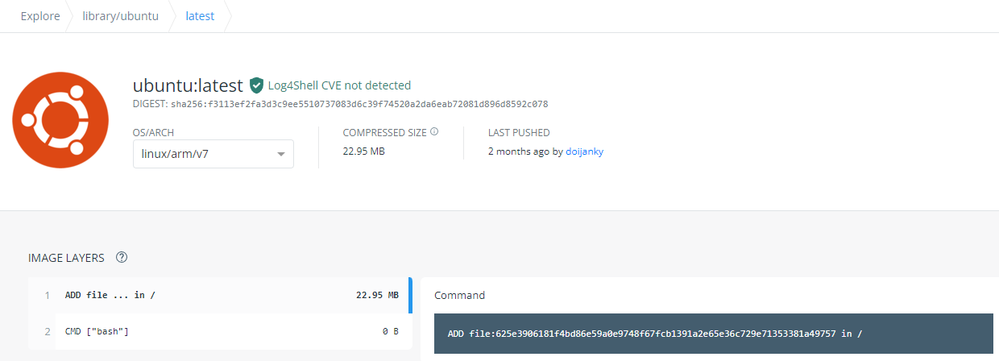

== 演習2:  OS のコンテナの実行

演習1では `nginx` のコンテナを実行しました。

こんどは、先ほどの `nginx` のようなアプリケーションが何もインストールされてない素の `OS` のイメージからコンテナを作成してみます。

`Docker Hub` にあるる `ubuntu` のイメージを元にコンテナを作成・実行してみます。名前は `my-ubuntu` にします。

```
$ docker run --name my-ubuntu  ubuntu

Unable to find image 'ubuntu:latest' locally
latest: Pulling from library/ubuntu
7b1a6ab2e44d: Pull complete
Digest: sha256:626ffe58f6e7566e00254b638eb7e0f3b11d4da9675088f4781a50ae288f3322
Status: Downloaded newer image for ubuntu:latest

$
```

ここでは、単にイメージ名として `ubuntu` とだけ指定しているので、 `Docker Hub` で公開されている https://hub.docker.com/_/ubuntu[ubuntu^] の `latest` のタグが付いたイメージがダウンロード( `pull` )されます。

稼働しているかどうか `docker ps` で確認してみます。

```
$ docker ps
CONTAINER ID   IMAGE     COMMAND   CREATED   STATUS    PORTS     NAMES

$
```

稼働してからすぐに Exit している事がわかります。

今度は `docker ps -a` を使用して、停止したコンテナも確認してみます。

```
$ docker ps -a
CONTAINER ID   IMAGE                                                     COMMAND                  CREATED          STATUS                      PORTS                  NAMES
10b401288650   ubuntu                                                    "bash"                   1 minutes ago   Exited (0) 1 minutes ago                          my-ubuntu

$
```

これを見ると `bash` が一瞬実行されたものの、すぐに終了した事がわかります。このようにコンテナでは、フォアグラウンドで稼働するプロセスが無いとすぐに終了してしまいます。

イメージの作りがどのようになっているかは、 https://hub.docker.com/layers/ubuntu/library/ubuntu/latest/images/sha256-f3113ef2fa3d3c9ee5510737083d6c39f74520a2da6eab72081d896d8592c078?context=explore[Docker Hub^] のページで確認ができますが、 `CMD["bash"]` と書かれており、これはコンテナ起動時に `bash` が実行されるように作られている事を意味します。が、この `bash` は、特にする事もないので、プロセスとしてはすぐに終了します。



演習1では `nginx` がフォアグラウンドで稼働していたのでコンテナが稼働し続けてましたが、稼働し続けるプロセスが無いとこのようにコンテナ自体が終了してしまいます。

今度は、 `-itd` という起動オプションを付けて `my-ubuntu2` という名前のコンテナを作ります。

```
docker run -itd --name my-ubuntu2 ubuntu 
```

ここで `-itd` というオプションは、使っていると意味をだんだんと忘れてしまい手が勝手に動くようになりますが、以下のような意味があります。

=== オプション -itd 
`-i` : interactive. Keep STDIN open even if not attached. + 
`-t` : Allocate a pseudo-TTY. コンテナに疑似tty(pseudo-TTY)を作る。 +
`-d` : Run container in background and print container ID. デタッチ。コンテナをバックグラウンドで動かす。

これらはバラバラのオプションなので `-it -d` や、 `-i -t -d` のようにバラバラに指定もできます。
殆どの用途で `-it` はセットで使われ、 `-it` や `-itd` のように使われます。

`-i` と `-t` は、コンテナと、自分が使っているホスト上のコンソールが、コンテナと通信できるようにセットアップするためのオプションです。
`-it` は、今は、ひとかたまりに自分のコンソールからコンテナ内部を覗いて見るのに必要なオプション。と覚えておきましょう。

次に、 `docker ps` コマンドでコンテナの稼働を確認してみます。

```
$ docker ps
CONTAINER ID   IMAGE     COMMAND       CREATED         STATUS         PORTS     NAMES
34d28c35a11b   ubuntu    "bash"   5 minutes ago   Up 5 minutes             my-ubuntu2

$
```

今度はコンテナが稼働したままです。

=== なぜコンテナが起動したままなのか

`-t` オプションは、コンテナに、pts(疑似端末)を作るオプションです。疑似端末が作成され、起動した `bash` がインタラクティブモードで接続した状態になります。この `bash` が起動したままになるため、コンテナが終了せずに稼働し続ける事ができるようになっています。

=== docker attach でコンテナの中を覗く

コンテナ `my-bunutu2` の中を覗いてみます。
これは `docker attach  <コンテナ名 | CONTAINER ID>` で可能です。

```
docker attach my-ubuntu2
root@34d28c35a11b:/# ps -ef                       
UID        PID  PPID  C STIME TTY          TIME CMD
root         1     0  0 04:57 pts/0    00:00:00 bash
root        17     1  0 05:06 pts/0    00:00:00 ps -ef
root@34d28c35a11b:
```

コマンドプロンプトが変わり、コンテナ内に入った事がわかります。
同時に `ps -ef` コマンドを実行すると、 `bash` と自分自身である `ps -ef` しか動いてない事がわかります。
`ps -ef` の親のプロセスは `PID=1` の `bash` である事がわかります。

**コンテナにはログインの概念が無い**ので、この `attach` というのはコンテナ独特の考え方になります。
ログイン時に新規に `bash` 等のシェルが起動する Linux の通常のログインの仕組みと違い、既に動いていた `bash` を使用しています。

次にこの `bash` 上で `exit` をしてみます。

```
root@34d28c35a11b:/# exit
exit

$
```

`exit` すると、はじめに動いていた `bash` からも `exit` してしまってコンテナが停止します。

`docker ps` でコンテナが終了している事を確認します。

```
$ docker ps
CONTAINER ID   IMAGE     COMMAND   CREATED   STATUS    PORTS     NAMES

$
```

=== docker exec でコンテナの中を覗く

先ほどのステップで停止してしまったコンテナを `docker start` コマンドで、再度起動します。

```
$ docker start my-ubuntu2
```

今度は、`docker exec` というコマンドでコンテナの中を覗きます。

正確には `docker exec` は、起動中のコンテナ内で新しいプロセスを起動するプロセスです。コンテナ内で起動する新しいプロセスを引数で指定する必要がありここでは `/bin/bash` を指定します。


```
$ docker exec -it my-ubuntu2 /bin/bash
root@34d28c35a11b:/# ps -ef
UID        PID  PPID  C STIME TTY          TIME CMD
root         1     0  0 05:15 pts/0    00:00:00 bash
root        21     0  0 05:18 pts/1    00:00:00 /bin/bash
root        29    21  0 05:18 pts/1    00:00:00 ps -ef
root@34d28c35a11b:/#
```

中で `ps -ef` コマンドを実行すると、今度は3つのプロセスが動いており `ps -ef` の親プロセス IDは `PID=21` です。つまり `PID=21` が `docker exec` によって新規に起動された `bash(/bin/bash)` です。

この `bash(/bin/bash)` が接続している `TTY` は `pts/1` になっていて、コンテナ内にもともと存在している `pts/0` とは別である事がわかります。

コンテナから `exit` してみます。

```
root@34d28c35a11b:/# exit
exit

$
```


`docker ps` で確認すると、 `attach` でコンテナに接続した時とは違い、コンテナがまだ稼働したままである事がわかります。

```
$ docker ps
CONTAINER ID   IMAGE     COMMAND       CREATED          STATUS         PORTS     NAMES
34d28c35a11b   ubuntu    "/bin/bash"   23 minutes ago   Up 5 minutes             my-ubuntu2

$
```

`docker exec` では新規に `/bin/bash` をコンテナ内で起動したので、`exit` で終了したのは新規に起動した `/bin/bash` だけになります。

一方で `docker attach` では、元々、 `-t` オプションを付けた事でコンテナ内で起動していたシェルに接続( `attach` )し、そのシェルを `exit` してしまったため、他にプロセスがなくなりコンテナが終了してしまいました。

なんとかく `attach` と `exec` のそれぞれで、コンテナの中を見る時の動きの違いがわかったと思います。

以上で演習2は完了です。お疲れ様でした。
